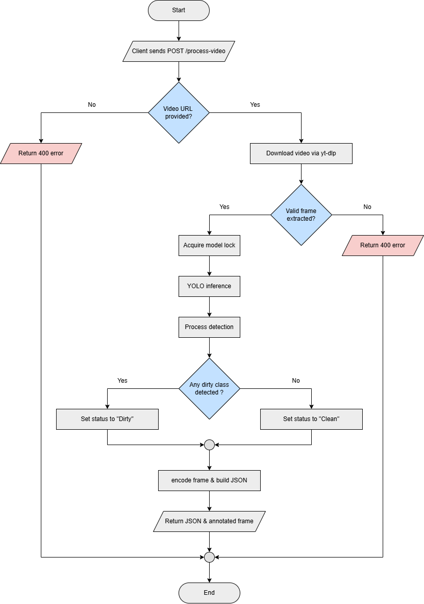

# Cleanliness-NMSAI

Cleanliness-NMSAI is an AI microservice for automated cleanliness detection from video sources. The service processes video input, performs object detection using a YOLO-based model, and determines whether an area requires cleaning.

This system is designed for controlled CPU environments and containerized deployments, with built-in safeguards to ensure stable operation under concurrent load.

---

## Overview

Cleanliness-NMSAI provides an HTTP API that:

1. Accepts a video file or direct video URL.
2. Downloads and normalizes the video.
3. Extracts a frame at a predefined timestamp.
4. Performs thread-safe YOLO inference.
5. Classifies detections into clean and dirty categories.
6. Groups nearby dirty detections into larger clustered areas.
7. Returns structured JSON results along with an annotated image (Base64 encoded).

The service is built with FastAPI and designed for scalable backend deployment.

---

## Key Features

- Production-grade FastAPI service
- Global model loading at startup
- Thread-safe inference using locking mechanism
- Support for uploaded video files and direct video URLs
- Automatic video normalization via FFmpeg
- Single-frame inference for deterministic processing
- Dirty-area clustering (maximum two grouped regions)
- Clean/Dirty rule-based classification logic
- Annotated image returned as Base64
- Dockerized deployment configuration
- Headless OpenCV for server environments

---

## System Architecture



---

## Detection Logic

The detection system classifies objects into two categories:

### Dirty Classes

```python
DIRTY_CLASSES = {
    "dryleaves",
    "grass",
    "tree"
}
```

### Clean Classes

```python
CLEAN_CLASSES = {
    "ground"
}
```

Detection rules:

```text
1. If dirty objects exist → DIRTY
2. Else if ground exists → CLEAN
3. Else if no objects detected → CLEAN
4. Otherwise → CLEAN
```

Dirty detections are grouped into at most two larger regions using center-based clustering to reduce excessive overlapping boxes and simplify visualization.

---

## System Workflow

```text
Video Input
     ↓
Video Normalization (FFmpeg)
     ↓
Frame Extraction
     ↓
YOLO Inference
     ↓
Detection Filtering
     ↓
Dirty/Clean Classification
     ↓
Dirty Area Clustering
     ↓
Status Decision
     ↓
Annotated Output + JSON Response
```

---

## Model Distribution

The production model is distributed via GitHub Release.

Version:

`v1.2.0`

Model File:

`cleanliness-11x-100.pt`

The application automatically downloads the model at startup if it is not present locally.

---

## Configuration

Core configuration parameters are defined in `app.py`:

```python
CONF_THRESHOLD = 0.15
IOU_THRESHOLD = 0.5
MAX_DET = 300

FRAME_SKIP = 90
FPS = 30

TARGET_WIDTH = 1280
TARGET_HEIGHT = 720

DIRTY_CLASSES = {"dryleaves", "grass", "tree"}
CLEAN_CLASSES = {"ground"}
```

Configuration purpose:

| Parameter | Description |
|------------|-------------|
| CONF_THRESHOLD | Minimum confidence for detection |
| IOU_THRESHOLD | Threshold for custom NMS |
| MAX_DET | Maximum detections from YOLO |
| FRAME_SKIP | Frame position for extraction |
| FPS | Video FPS assumption |
| TARGET_WIDTH | Output width |
| TARGET_HEIGHT | Output height |

---

## API Specification

### Endpoint

POST `/process-video`

### Request Body

Video URL:

```json
{
  "video_url": "https://example.com/video.mp4"
}
```

or multipart upload:

```text
video_file=<video>
```

---

### Response Example

```json
{
  "status": "Dirty",
  "message": "Area needs cleaning",
  "detections": [
    {
      "class": "dirty_area",
      "confidence": 0.91,
      "bbox": [100,120,350,500],
      "is_dirty": true
    }
  ],
  "image_base64": "..."
}
```

Response fields:

- `status` → `"Dirty"` or `"Clean"`
- `message` → Human-readable summary
- `detections` → Clustered dirty regions
- `image_base64` → Annotated frame in Base64

---

## Resource Protection Strategy

To ensure safe production deployment, the system enforces:

- Single-frame processing
- Thread-safe YOLO inference
- Global model loading
- Controlled image resizing
- Headless OpenCV execution
- Manual NMS and clustering logic

This approach minimizes CPU spikes and improves system stability under concurrent usage.

---

## Project Structure

```text
cleanliness-nmsai/
│
├── app.py
├── Dockerfile
├── docker-compose.yml
├── requirements.txt
├── .dockerignore
├── .gitignore
├── documentation/
│   └── cleanliness-nmsai-system-architecture.png
└── README.md
```

---

## Docker Deployment

### Build Image

```bash
docker build -t cleanliness-nmsai .
```

### Run Container

```bash
docker run -p 8003:8000 cleanliness-nmsai
```

Service will be available at:

```text
http://localhost:8003/process-video
```

---

## Technology Stack

- FastAPI
- Uvicorn
- Ultralytics YOLO
- PyTorch
- OpenCV (headless)
- FFmpeg
- Docker

---

## Production Considerations

- Designed primarily for CPU-based deployments
- Model loaded once at startup to avoid repeated memory allocation
- Supports concurrent requests using thread locking
- Suitable for VPS and container environments
- Can be extended to support GPU acceleration
- Can be integrated with queue-based or asynchronous processing systems

---

## Versioning

### v1.0

Initial production release including:

- Core inference pipeline
- YOLO integration
- Docker deployment support
- Model distribution system

### v1.1.0

Model upgrade release including:

- Updated cleanliness detection model
- Improved detection performance and efficiency
- Maintained API compatibility

### v1.2.0

Second model upgrade release including:

- Added texture-enhanced dataset training
- Improved ground detection capability
- Added clean vs dirty decision logic
- Added dirty-area clustering
- Improved inference quality
- Maintained API compatibility

---

## License

Copyright (c) 2026 Eldisja Hadasa

All rights reserved.

This software and associated documentation files (the "Software") are proprietary and confidential.

No part of this Software may be copied, modified, distributed, sublicensed, or used for commercial purposes without explicit written permission from the copyright holder.

Unauthorized use, reproduction, or distribution of this software is strictly prohibited.

---

## Maintainer

**Eldisja Hadasa**

The **Cleanliness-NMSAI** project implements a containerized AI inference service for detecting cleanliness-related objects in video streams using FastAPI and YOLO, designed for CPU-efficient concurrent deployment using Docker and thread-safe inference execution.

- GitHub: https://github.com/mirteldisa01
